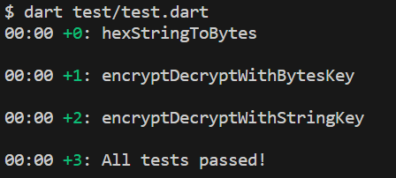
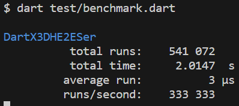

# dart_x3dh_e2e

dart_x3dh_e2e is a robust and secure project that focuses on implementing end-to-end encryption using the Extended Triple Diffie-Hellman (X3DH) key agreement protocol. The project aims to provide a reliable solution for secure communication, ensuring privacy and data integrity. It's designed with the vision of making the internet a safer place by enabling developers to easily integrate high-standard encryption into their applications.

# Encryption and Decryption Utility

This utility provides functions for encrypting and decrypting data using the AES-256-GCM encryption algorithm. It utilizes the `cryptography` for encryption and decryption operations.

## Prerequisites

Ensure that you have Dart and Flutter installed on your machine. You can install them by following the instructions provided at [https://flutter.dev/docs/get-started/install](https://flutter.dev/docs/get-started/install).

## Usage

1. Add the `aes_gcm` and `rand` crates as dependencies in your `Cargo.toml` file:

   ````yaml
    dependencies:
        convert: ^3.1.1
        cryptography: ^2.7.0
   ```

2. Import the required packages in your Dart code::

   ````dart
    import 'dart:convert';
    import 'package:convert/convert.dart';
    import 'package:cryptography/cryptography.dart';
   ```

3. Implement the `hexStringToBytes` function to convert a hexadecimal string to a byte list:

   ````dart
    List<int> hexStringToBytes(String hexString) {
        // Implementation details...
    }
   ```

4. Implement the `performEncryption` function to perform the encryption process:

   ````dart
    List<int> performEncryption(List<int> key, List<int> plaintext) {
        // Implementation details...
    }
   ```

5. Implement the `encryptWithHexStringKey` function to encrypt data using a shared secret key provided as a hexadecimal string:

   ````dart
    List<int> encryptWithHexStringKey(String sharedSecretKey, String plaintext) {
        // Implementation details...
    }
   ```

6. Implement the `encryptWithBytesKey` function to encrypt data using a shared secret key provided as a byte list:

   ````dart
    List<int> encryptWithBytesKey(List<int> sharedSecretKey, String plaintext) {
        // Implementation details...
    }
   ```

7. Implement the `decryptWithHexStringKey` function to decrypt data using a shared secret key provided as a hexadecimal string:

   ````dart
    String decryptWithHexStringKey(String sharedSecretKey, List<int> ciphertext, List<int> iv) {
        // Implementation details...
    }
   ```

8. Implement the `decryptWithBytesKey` function to decrypt data using a shared secret key provided as a byte list:

   ````dart
    String decryptWithBytesKey(List<int> sharedSecretKey, List<int> ciphertext, List<int> iv) {
        // Implementation details...
    }
   ```

9. Use the provided functions in your code to encrypt and decrypt data as needed.

   ````dart
    void main() {
        const sharedSecretKey = '0123456789abcdef0123456789abcdef';
        const plaintext = 'This is a secret message.';

        final ciphertext = encryptWithHexStringKey(sharedSecretKey, plaintext);
        print('Ciphertext: $ciphertext');

        final decryptedText = decryptWithHexStringKey(sharedSecretKey, ciphertext);
        print('Decrypted Text: $decryptedText');
    }
   ```

   Remember to replace `0123456789abcdef0123456789abcdef` with your actual shared secret key.

## Running Tests
You can run tests for this project using the following command:
```dart
$ dart test/test.dart
```

The test results will be displayed in the console.


##### Performance BenchmarksTo measure the performance of this project, you can run benchmarks using the following command:

## Running Benchmark
You can run bench for this project using the following command:
```rust
$ dart test/benchmark.dart 
```

## Contributions

Contributions are welcome! If you find any issues or have suggestions for improvements, please feel free to open an issue or submit a pull request.

## License
This project is licensed under the [MIT License](LICENSE).

Feel free to customize the content according to your specific requirements and project details.
